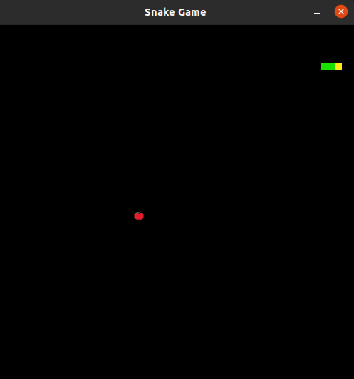

# Desciption
Snake game with C++ and Qt5.

### Rules:
- Can't cross boarders - you lose
- Can't cross snake's body - you lose
  
# Building
### Local dependencies
```
- GCC 9.4
- CMake 3.5
- Qt5 5.15
```
New versions of Qt5 after 5.9 depricated randomizer qrand() and added QRandomGenerator. Be carefull if you have a Qt5 version lower than 5.10.

### Instructions
```
git clone https://github.com/skvoretss/Snake;

cmake -S Snake -B Snake/build;

cmake --build Snake/build;

./Snake/build/snake;
```
### Demonstation

